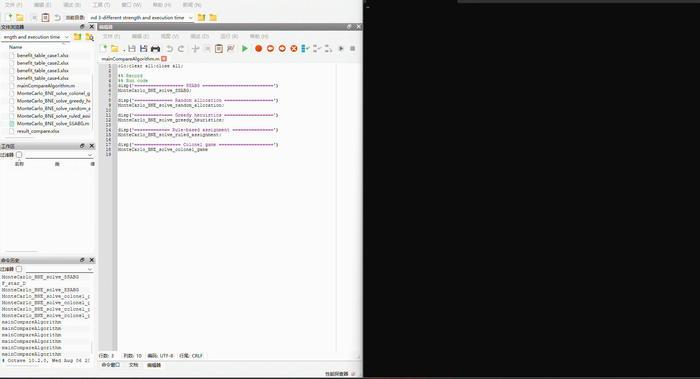

# How to run?

- Run `mainCompareAlgorithm.m` in folder `./Experiment 1 and 3-different strength and execution time` to validate experiment 1 and experiment 3 in the manuscript. The comparison of defense effectiveness and execution of RA, GH, RBA, CBG, and SSABG in Case #1-#4 can be found in `result_compare.xlsx`.
- Run `mainCompareAlgorithm.m` in folder `./Experiment 2-different p` to validate experiment 2 in the manuscript. The comparison of defense effectiveness of RA, GH, RBA, CBG and SSABG with different prior probability $P_1^A$ can be found in `result_compare.xlsx`.

This project is run by `Octave`.

# Videos

The running videos (`.gif`) of experiments 1 and 3 and experiment 2 are given as follows.

You can also find them in folder `./Videos`.

# License

This project is licensed under the GNU General Public License (GPL) Version 3. You can find the full text of the license in the LICENSE file.

By using, modifying, or distributing this software, you agree to comply with the terms of the GPL license. If you did not receive a copy of the license, you can obtain it from [https://www.gnu.org/licenses/gpl-3.0.txt](https://www.gnu.org/licenses/gpl-3.0.txt).

**Note**: This license requires that any derivative works or modifications of this software must also be distributed under the same license.

